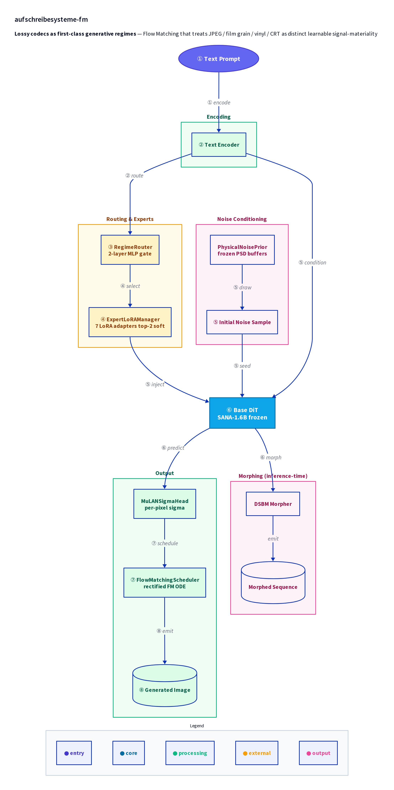

# Aufschreibesysteme Flow Matching (`afm`)

> Lossy codecs as first-class generative regimes — a Flow Matching framework that treats JPEG / film grain / gramophone / vinyl PSD / typewriter / parchment / CRT as distinct, learnable signal-materiality regimes rather than post-hoc style transfer.

**Status:** research preview (rolling preprint, not deadline-driven). License: MIT.

> **PyPI note:** The package name `afm` on PyPI is currently held by an unrelated project (Xiaoyu Zhai, v0.0.1). `pip install afm` will NOT install this package. PyPI publish will require renaming the package — tracked as a future task. Until then, install directly from source: `pip install git+https://github.com/hinanohart/aufschreibesysteme-fm`.

**This is a resumable semi-auto pipeline with 4 explicit human-review gates.** It is not, and does not claim to be, "fully automatic" end-to-end — license audit, expert-collapse, HF Space publish, and preprint draft all pause for human confirmation by design. <!-- honest:ok -->

---

## Architecture overview

<div align="center">
  
</div>

---

## What this is

Current Flow Matching / DiT-style generators silently assume a flat, homogeneous latent space. Real inscription channels are not flat — a JPEG quantisation lattice, the PSD of a 78 rpm shellac groove, ISO12233 film grain, and CRT phosphor decay each impose distinct, measurable structure on the signal. This project treats each such structure as a **regime**, attaches a frozen physical-noise prior derived from measurement (never learned, never tuned), and routes between regimes with a top-2 soft mixture of LoRA experts.

The framing is borrowed from Friedrich Kittler's media-theoretical concept of *Aufschreibesysteme* (discourse / inscription networks: 1800 / 1900 / 2000). It is used as motivation, not as evaluation: the metrics are entirely signal-materiality based.

---

## 1-command quickstart

```bash
pipx install afm                        # or: uv tool install afm
afm demo --regime jpeg                  # downloads pre-trained LoRA, generates a sample
afm morph --prompt "a tower at dusk" \
          --from photograph --to gramophone --steps 50
```

Train from scratch on a single 24 GB GPU:

```bash
afm oss --resume \
        --pause-on=licence-fail,collapse,space-deploy,preprint \
        --config configs/mvp.yaml
```

That single command drives the full 8-step pipeline (env → data → lora × 7 regimes → gate → eval → release → HF Space → preprint). It will **pause** at the 4 review gates and resume cleanly from `state.json`.

---

## The 7 regimes

| Regime | Aufschreibesystem | Codec | Physical noise prior |
|---|---|---|---|
| Parchment / handwriting | 1800 | DiffVG vector | ink-bleed gaussian |
| Typewriter | 1800 | pixel | impact PDF |
| Gramophone | 1900 | EnCodec mel | 78 rpm shellac PSD |
| Photograph | 1900 | pixel | ISO12233 grain |
| Film | 1900 | pixel + temporal | grain + Diffusion Forcing per-frame σ |
| JPEG | 2000 | DCT 8×8 | quantisation table Q∈{10, 50, 90} |
| CRT | 2000 | pixel | scanline + phosphor decay |

Each regime is implemented in `afm/regimes/<name>.py` and exposes a `RegimeSpec`.

---

## How it works

- **Base:** SANA-1.6B (Apache-2.0), frozen. Showcase: Flux-schnell-12B (Apache-2.0), QLoRA.
- **Experts:** LoRA rank-32 hooks on cross-attn (Q,K,V,out proj) and FFN up/down per regime.
- **Routing:** 2-layer MLP gate (hidden=256) on (DiT layer-4 patch-mean ⊕ text CLS) → softmax → top-2 *soft*.
- **Load balance:** `L_lb = λ·N·Σᵣ fᵣ Pᵣ`, λ=0.01. Gate entropy < 0.3 nats over 1 k steps → λ auto-doubles.
- **Physical prior:** `register_buffer("psd_{regime}", measured_tensor)` — frozen, never trained. Sampling: `ε_r = F⁻¹(√PSDᵣ · F(z))`.
- **MuLAN σ:** per-pixel σ head, clipped: `σ_pred(x,r) = max(σ_min^(r), MuLAN_θ(x))`.
- **Morphing:** `afm morph` runs Diffusion Schrödinger Bridge Matching (Shi+2023) between any two regimes — inference-time only, default ON, does not add to training cost.

Full spec: see [`docs/architecture.md`](docs/architecture.md). Kittler motivation and Lacan-misreading caveats: [`docs/appendix_kittler.md`](docs/appendix_kittler.md).

---

## The 4 human-review gates

This pipeline is intentionally **not** fully automatic. The gates exist because each of these decisions is one we want a human to sign off on, not an unattended bot. <!-- honest:ok -->

| Gate | When | What needs human approval |
|---|---|---|
| **G1 licence-fail** | end of step 1 (data) | audio whitelist diff (EU 70-year neighbouring rights are the reason) |
| **G2 collapse** | during step 3 (gate) | expert-collapse detection — gate entropy crossed the threshold |
| **G3 space-deploy** | end of step 5.5 | teaser image + HF Space app review before public push |
| **G4 preprint** | end of step 6 (optional) | arXiv preprint draft review before submission |

Pass them via the `--pause-on` flag. Hitting a gate writes a clean `state.json` and exits with a deterministic message — `afm oss --resume` picks up where you left off.

### 3-branch resume protocol

```bash
test -f state.json && cat state.json | jq .current_step || echo "fresh"
```

| `current_step` | Branch | Action |
|---|---|---|
| (no state.json)        | fresh   | start at step 0 |
| `< 6`                  | partial | resume from `current_step` |
| `== 6`                 | done    | `afm oss --eval-only` or move to ablation |

---

## What this is NOT

- It is not a "stylise like JPEG" filter. Lossy codecs are first-class regimes here, not post-hoc decorations. (`docs/signal_materiality.md` makes the technical distinction.)
- It is not a Kittler implementation. We borrow the *Aufschreibesysteme* framing for motivation; metrics are signal-materiality only. See [Winthrop-Young, Peters, Krämer cross-check in appendix](docs/appendix_kittler.md).
- It is not fully automatic. See "4 human-review gates" above. <!-- honest:ok -->

---

## Hardware budget

| Phase | Cost | Where |
|---|---|---|
| 1 regime LoRA  | 30 k step · ~1.0 s/step · ~8.5 h · ~18–20 GB VRAM | RTX 4090 (or A100/H100) |
| 7 regimes sequential | ~60 h | sequential at 24 GB (parallel infeasible) |
| Gate router + eval + HF Space | ~6 h | same GPU |
| **MVP total wall-clock** | **~66 h ≈ 2.75 days** | single 24 GB GPU |
| Full ablation (12 cells) | ~18 days | post-MVP, separate critical path |

Mid-step crash bound: `save_steps=500` keeps lost progress under 30 minutes per regime.

---

## Repo layout

```
aufschreibesysteme-fm/
├── afm/
│   ├── core/      # trainer, physical_noise_prior, regime_router, expert_lora, mulan_sigma, schedulers
│   ├── regimes/   # 7 regime files + base.py (RegimeSpec)
│   ├── data/      # loaders, license-audited manifests
│   ├── eval/      # M1-M4 (recall / FID / morph smoothness / inscription consistency)
│   ├── morph/     # DSBM cross-regime morphing
│   ├── cli/       # afm oss / train / infer / morph / space-deploy / demo
│   └── state/     # state.json atomic manager (v0.2 schema)
├── configs/       # mvp.yaml
├── data/          # measurement scripts, datasets, license-audited manifests
├── scripts/       # fetch_measurements.py, audit_audio.py
├── eval/          # eval outputs and figures
├── examples/      # train_sana.ipynb, infer_cli.py, morph_demo.ipynb
├── space/         # HF Space gradio app + teaser_gen.py
├── docs/          # signal_materiality.md, appendix_kittler.md, architecture.md
├── tests/         # pytest (no GPU required)
├── paper/         # rolling preprint LaTeX
└── experiments/_wip/  # crash retention (atomic step-failure dumps)
```

---

## Reproducing the figures

```bash
afm oss --resume --config configs/mvp.yaml --pause-on=licence-fail,collapse,space-deploy,preprint
# … 4 gates later …
afm demo --regime jpeg
afm morph --from photograph --to gramophone --steps 50
```

Identical caption set, 200 k step budget, frozen text encoder across all baselines (B1 vanilla SANA + style-LoRA, B2 SANA + IP-Adapter, B3 DDCM, B4 FGA-NN). See `eval/` outputs.

---

## Acknowledging dependencies (all MIT / MIT compatible)

`diffusers`, `peft`, `accelerate`, `transformers`, `torch`, `safetensors`, `huggingface_hub`, `bitsandbytes` (MIT), `encodec` (MIT), `diffvg` (MIT), `pyrtools` (MIT), `gradio` (MIT), `httpx`, `pydantic`. Base model SANA-1.6B (Apache-2.0, NVlabs). The audit script `scripts/audit_audio.py` will fail loudly on anything unlisted.

---

## Citation

If this work is useful to you, a citation of the rolling preprint (see `paper/main.tex` for the live arXiv ID once posted) is appreciated.

Until the preprint is on arXiv, a software citation is also fine:

```bibtex
@misc{afm2026,
  title  = {Aufschreibesysteme Flow Matching: lossy codecs as first-class generative regimes},
  author = {hinanohart},
  year   = {2026},
  url    = {https://github.com/hinanohart/aufschreibesysteme-fm},
  note   = {v0.1.0-alpha; see also CITATION.cff in the repo}
}
```

---

## Contributing

Issues and PRs welcome. Two house rules:

1. Do not embed R-number references (e.g. "R14") in commit messages — they reference an internal rule set, not user-facing context.
2. Do not describe the pipeline as "fully automatic" / "permanent" anywhere user-facing — say "resumable semi-auto with 4 explicit human-review gates." <!-- honest:ok -->

